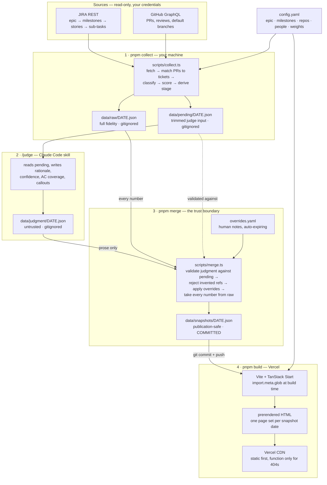

# Epic Status Dashboard

A daily engineering status page for **one epic**. It pulls JIRA and GitHub,
derives a deterministic score from what actually shipped, adds a written
judgment layer, and publishes a fully static site from committed snapshots.

Everything project-specific — the epic, milestones, features, owners, repos,
people — lives in `config.yaml`, never in source. Point it at a different
epic and nothing in `src/` changes.

The rule the whole thing exists to enforce: **a PR merged into an
integration branch is `staged`, not `shipped`.** Only a merge into the
repo's default branch is `shipped`, and JIRA saying "Done" without a PR to
prove it is `done_unverified` — never silently upgraded.

---

## Pipeline at a glance



### The four stages

| # | Stage | Command | Reads | Writes | Committed? |
|---|-------|---------|-------|--------|-----------|
| 1 | Collect | `pnpm collect` | JIRA, GitHub, `config.yaml` | `data/raw/`, `data/pending/` | No |
| 2 | Judge | `/judge` in Claude Code | `data/pending/` | `data/judgment/` | No |
| 3 | Merge | `pnpm merge` | `data/raw/`, `data/pending/`, `data/judgment/`, `overrides.yaml` | `data/snapshots/` | **Yes** |
| 4 | Publish | `pnpm build` (on Vercel) | `data/snapshots/`, `config.yaml` | prerendered HTML | build output |

Stage 4 is triggered by pushing stage 3's output. The deployed site never
talks to JIRA or GitHub — see [Deploying](#deploying-to-vercel).

### Why the data directories are split

Four directories, one per trust level. Only the last one is committed.

- **`data/raw/`** — everything fetched, uncleaned: full PR bodies, complete
  file lists. Debugging fidelity, never published.
- **`data/pending/`** — the judge's *only* input. PR bodies cleaned by
  `src/lib/prbody.ts` and capped at 1500 chars, file paths kept for scope
  corroboration. Trimmed so the judgment step sees evidence, not raw dumps.
- **`data/judgment/`** — model output, treated as **untrusted input**.
- **`data/snapshots/`** — the only publication-safe artifact, and the only
  thing the dashboard ever reads.

`scripts/merge.ts` is the gate between the last two, and it splits the
snapshot in half by provenance:

- **Every number comes from `data/raw/`** — score, scoreBasis, PR refs,
  release gate, staleness. Collect's deterministic output, untouched.
- **The judgment contributes prose only** — rationale, confidence, AC
  coverage, callouts — plus one bounded numeric escape hatch: a
  `scoreOverride` that must carry a reason and land within 20 points of the
  computed score. Stage is then re-derived by merge from the effective
  score, so an override moves the pill honestly rather than being pasted on.

Before any of that, the judgment is validated against the day's pending
file and the whole thing is rejected (non-zero exit, nothing written) on
anything unparseable, any feature key, AC id, story key, or PR ref that
isn't in that day's data, or an unreasoned / oversized `scoreOverride`. The
judge can *explain* the data; it cannot *invent* it.

There is no `ANTHROPIC_API_KEY` and no programmatic model call anywhere in
this codebase. The judgment step is a Claude Code routine you run, not a
script.

---

## How a status is derived

Deterministic, pure, and tested — `src/lib/classify.ts` and
`src/lib/score.ts` do this with no network and no judgment.

**Per story**, JIRA's status is mapped through `config.yaml`'s `statusMap`
to get a base, then GitHub evidence upgrades it (a stale JIRA status must
never outrank real PR state):

```
any PR merged into the default branch  →  shipped
base was "Done" but nothing proves it  →  done_unverified
any PR merged elsewhere                →  staged
any PR open                            →  in_review
otherwise                              →  the mapped JIRA status
```

Sub-task evidence only ever *raises* a story: all sub-tasks shipped lifts it
to at least `shipped`; any sub-task with live PR activity lifts it to at
least `in_review`. It never unions PRs flatly — one merged sub-task out of
five must not declare the whole story shipped.

**Per feature**, the score is the weighted mean of its story statuses
(weights from `config.yaml`), rounded to the nearest 5. `scoreBasis` keeps
the raw unweighted counts for display, never back-derived from the score.

**Stage** bands the score, with two escape hatches in opposite directions:

```
0 → not_started   <25 → early   <70 → underway   <100 → nearly_done   100 → done
```

`done` additionally requires *every* story shipped to the default branch —
a feature that hits 100 on weight alone while stories sit staged stays
`nearly_done`. Overriding all of it: **product sign-off** forces `done`,
because a human's out-of-band approval outranks both the score and the
GitHub check.

Sign-off is read from the feature ticket's own JIRA status. Moving an
epic/milestone/feature ticket to **Product Review** emails its product
manager; approval sends it straight to Done, rejection back to In
Progress — so for epic work, reaching Done *is* the sign-off. Both statuses
are named in `config.yaml` (`jira.productReviewStatus`,
`jira.signedOffStatuses`), and a feature sitting in review is published as
`awaitingSignOff` so the dashboard can show what product currently owes a
decision on. The retired "Product Approval" custom field is still read as a
fallback (`jira.productSignOffField`) for tickets approved under the old
flow; a live Product Review always outranks a stale label.

---

## Setup

1. **Install.** Also installs a gitleaks pre-commit hook — see
   [Secret scanning](#secret-scanning).

   ```bash
   pnpm install
   ```

2. **Credentials.** Copy `.env.example` to `.env.local` and fill in four
   variables:

   ```bash
   cp .env.example .env.local
   ```

   - `JIRA_BASE_URL` — your Atlassian site, e.g. `https://your-company.atlassian.net/`
   - `JIRA_EMAIL` — the email tied to your JIRA API token
   - `JIRA_API_TOKEN` — create one at
     [id.atlassian.com/manage-profile/security/api-tokens](https://id.atlassian.com/manage-profile/security/api-tokens).
     Basic-auth'd as `email:token`, base64-encoded; never logged.
   - `GITHUB_TOKEN` — a **classic** personal access token
     ([github.com/settings/tokens](https://github.com/settings/tokens)) with
     the `repo` scope. If your org enforces SSO, authorize the token for
     that org after creating it. A fine-grained token works too, but must be
     granted access to every repo in `config.yaml` — classic + SSO is
     simpler.

3. **Config.** Copy `config.example.yaml` to `config.yaml` and fill in your
   epic; the comments in that file document every field. Nothing in it is
   secret (ticket keys, repo names, GitHub logins), so it's committed on
   purpose — the dashboard's Config page renders it verbatim.

---

## Daily routine

```bash
pnpm collect
```

Prints a per-feature summary (score, stage, shipped/doneUnverified/staged/
total, release gate). **Halt if it exits non-zero** — that means *every*
feature failed to collect, not just one; check the printed collection
errors.

Then, in Claude Code, run the **judge** skill against today's pending file:

```
/judge
```

It reads `data/pending/<date>.json` and writes `data/judgment/<date>.json`
(rationale, confidence, AC coverage, callouts). The skill's full evidence
hierarchy lives in `.claude/skills/judge/SKILL.md`.

```bash
pnpm merge
```

Validates the judgment, applies non-expired `overrides.yaml` entries, and
writes `data/snapshots/<date>.json`. **Never commit when merge fails** —
on any rejection it writes nothing and exits non-zero.

`overrides.yaml` is the human channel into a snapshot: a note per ticket,
optionally suppressing a stall warning, each with a required `expires` date
so the file prunes itself instead of accumulating stale caveats. Its own
comments document the shape.

```bash
git add data/snapshots && git commit -m "snapshot: <date>" && git push
```

Vercel rebuilds on push and prerenders the new date automatically.

**Reruns are safe.** Every write in the pipeline is atomic (`.tmp` file +
rename, `src/lib/io.ts`) and same-day reruns overwrite in place — never
append, never duplicate, never a corrupt half-file after a crash. Dates are
computed in `config.timezone` via `logicalDate()` (`src/lib/config.ts`), not
UTC, so a run just after local midnight still writes the correct calendar
day.

---

## Dashboard UI

The public status page. Fully static: it reads `data/snapshots/*.json` at
**build time** via `import.meta.glob` — no server function, no runtime
fetch. Each snapshot is its own code-split chunk, so a growing history never
bloats the shared bundle.

### Routes

| Route | Page |
|-------|------|
| `/` | Today — the latest snapshot |
| `/attention` | What's stalled, blocked, or needs a human |
| `/reviews` | The review queue across all tracked repos |
| `/m/:id` | One milestone |
| `/f/:code` | One feature (slug: `F1.1` → `f1-1`) |
| `/config` | The live `config.yaml`, rendered |

Every route also exists under `/<date>` (e.g. `/2026-08-13/reviews`) for a
specific snapshot. Unknown dates 404 with a link back to the latest, and
feature anchors (`#f1-1`, `#m3-m4`) are linkable and scroll into view on
load.

### Commands

```bash
pnpm dev
```

```bash
pnpm build && pnpm preview
```

`pnpm build` runs the Vite client + SSR build, then prerenders `/` and one
page set per snapshot in `data/snapshots/`. `vite.config.ts` computes that
page list with a synchronous `readdirSync` at config-eval time, so a new
snapshot date is picked up automatically on the next build. It also resolves
`config.yaml` to a virtual module at build time — the client ships data, not
a YAML parser.

### Deploying to Vercel

Nothing to configure: no `vercel.json`, no output directory setting. Import
the repo and it works, because:

- **Nitro picks its own target.** No `preset` is set in `vite.config.ts` on
  purpose — Nitro reads the environment, so the same `pnpm build` produces a
  Node server in `.output/` locally and Build Output API v3 in
  `.vercel/output/` on Vercel.
- **Every real page is static.** Prerendered pages land in
  `.vercel/output/static/`, and the generated route config puts
  `handle: filesystem` *before* the server function — normal traffic is
  served from the CDN and never wakes the function. Hashed assets get a
  one-year immutable cache header.
- **The function is only a fallback.** It handles URLs that were never
  prerendered (a snapshot date that doesn't exist, a renamed feature slug)
  so those render the app's own not-found page — `/2099-01-01` returns a
  real 404, not a bare platform error.

**No environment variables are needed for the deployment.** `JIRA_*` and
`GITHUB_TOKEN` are read only by `scripts/collect.ts`, which runs on your
machine or in CI — never in the browser or in the deployed function. The
site is built entirely from what's committed.

The consequence worth knowing: **the deployed dashboard only updates when
you commit a new snapshot and push.**

### Design system

`src/components/dashboard/` is a small, consistently-used component library
(status pill, progress bar, KPI stat, feature card, callout, empty state, …)
— every page section is built from these, no one-off styling.
`src/lib/dashboard/` holds the pure, tested data-shaping logic (filtering,
staleness, since-last-snapshot diffing, the Slack summary builder, the
burn-up series), kept separate from rendering.

Color is reserved entirely for the seven work-status hues — shipped,
done_unverified, staged, in_review, in_progress, blocked, todo — defined as
`[data-status]` rules in `src/styles.css`. All interface chrome (buttons,
links, borders, focus rings) is achromatic, so status color never competes
with anything else on the page. The five `Stage` values reuse those same
hues rather than introducing a second palette, and status is always carried
by text too (`src/lib/dashboard/statusLabels.ts`), never by color alone.

---

## Repo map

```
config.yaml            epic, milestones, features, repos, people, weights
overrides.yaml         human notes per ticket, auto-expiring
scripts/
  collect.ts           stage 1 — fetch, match, classify, score
  merge.ts             stage 3 — validate judgment, apply overrides, publish
.claude/skills/judge/  stage 2 — the judgment routine
src/lib/               pipeline core: jira, github, classify, score, schema, prbody
src/lib/dashboard/     pure UI data-shaping: nav, diff, burnup, staleness, search
src/components/        the dashboard component library
src/routes/            file-based routes (latest + /$date variants)
data/                  raw → pending → judgment → snapshots (only the last is committed)
tests/                 vitest, fixtures only
docs/SPEC.md           the original spec
```

---

## Testing

```bash
pnpm test
```

Runs the vitest suite against fixtures only — no network calls, safe to run
without `.env.local` configured.

## Secret scanning

`pnpm install` runs `scripts/install-hooks.mjs`, which installs a
`.git/hooks/pre-commit` hook that runs
[gitleaks](https://github.com/gitleaks/gitleaks) (`.gitleaks.toml`) against
staged changes — if gitleaks is on your `PATH`. If it isn't, the hook warns
and lets the commit through, so install it to actually enforce the check:

```bash
brew install gitleaks
```

---

## Known limitations

- **Review-request timestamps are approximate.** GitHub's GraphQL API
  doesn't expose a review-request timestamp, so `reviewQueue[].requestedAt`
  uses the PR's `updatedAt` as the closest available proxy.
- **A feature only sees the repos it lists.** `config.yaml`'s feature
  `repos` lists are provisional in places (flagged in that file's comments).
  A feature spanning an unlisted repo will silently miss those PRs rather
  than error — expand the `repos` list as you notice it.
- **PR-body cleaning is tuned to one template.** PR descriptions are the
  judge's primary AC-coverage evidence (`src/lib/prbody.ts`), cleaned down
  to the substantive sections and capped at 1500 characters. A repo using a
  very different template may pass more of its body through uncleaned
  (harmless — still gitignored, judge-only input) or, in an unlikely worst
  case, get flagged `template_only` when it actually had content. Worth
  spot-checking `data/pending/<date>.json` if a repo's PRs consistently show
  `bodySignal: "template_only"`.
